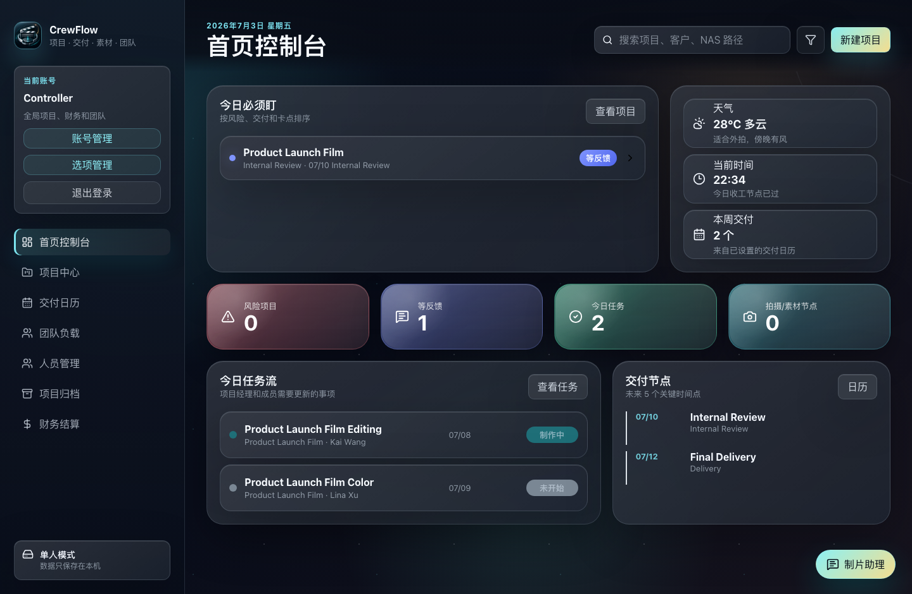
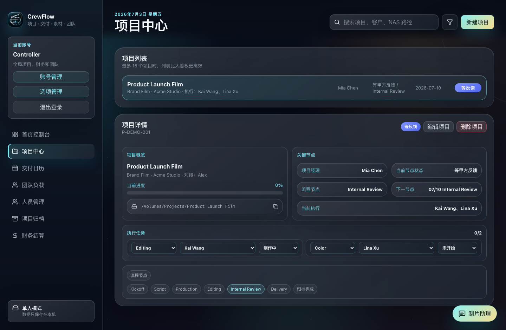
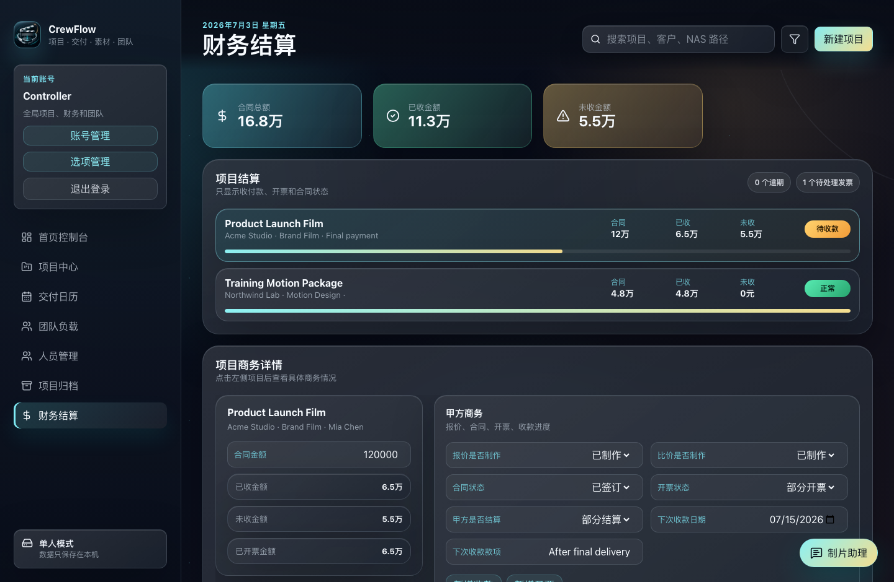
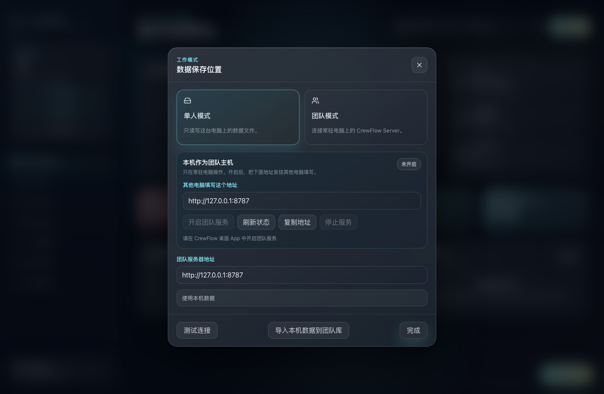

# CrewFlow

CrewFlow is a desktop command center for project intake, task assignment, delivery calendars, team workload, user accounts, archive management, and finance tracking.

It is built with Electron, React, and Vite, and supports both single-user local data and LAN team mode through a lightweight CrewFlow Server.

## Screenshots









## Features

- Role-based workspace for controller, admin, project manager, member, and finance users
- Project intake, project details, task assignment, and workflow tracking
- Personal task view for assigned work
- Delivery calendar for project milestones
- Team workload overview
- Staff, account, and option management
- Project archive
- Finance tracking for contracts, payments, invoices, and settlement status
- Single-user mode with local data storage
- LAN team mode with a host computer running CrewFlow Server

## Default Account

Clean initial data includes one controller account:

```text
Account: zk
Password: 123456
```

Change this account after first login.

## Data Modes

### Single-User Mode

Data is stored on the current computer. This mode is suitable for local use, evaluation, or single-person management.

Default macOS data file:

```text
~/Library/Application Support/CrewFlow/crewflow-data.json
```

### LAN Team Mode

Team mode uses one always-on Mac or Windows computer as the LAN host. Other clients connect to that host through HTTP with a CrewFlow access key.

Typical connection URL:

```text
http://HOST_LAN_IP:8787
```

For daily use, open CrewFlow on the host computer and click “开启团队服务” in “工作模式”. The app installs a background service and shows the LAN address and access key for other clients.

See [server/README.md](server/README.md) for CrewFlow Server details.

## Development

Install dependencies:

```bash
npm install
```

Run the desktop app in development:

```bash
npm run desktop
```

Run only the Vite dev server:

```bash
npm run dev
```

Run the team server manually:

```bash
npm run team:server
```

## Verification

```bash
npm test
npm run lint
npm run build
```

## Packaging

Build the macOS unpacked app:

```bash
npm run package:mac
```

Build the Windows unpacked app:

```bash
npm run package:win
```

Build both:

```bash
npm run package:all
```

Output paths:

- `release/mac/CrewFlow.app`
- `release/win-unpacked/CrewFlow.exe`

## License

MIT
